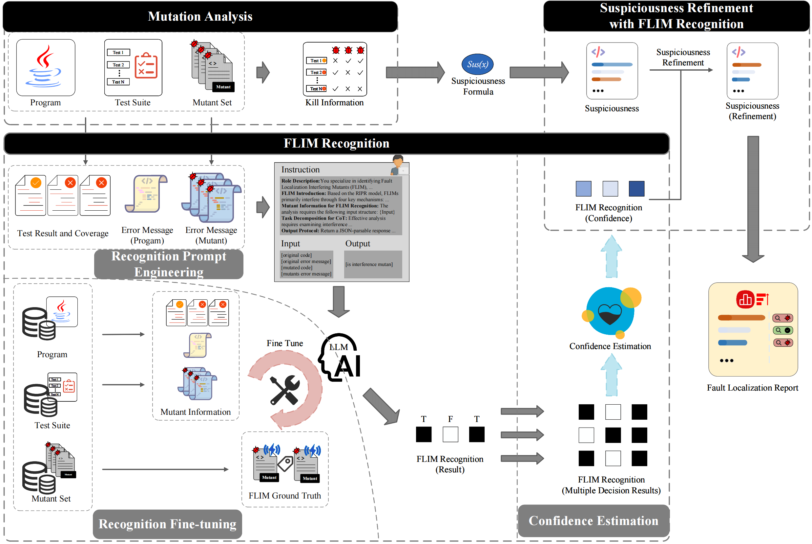

# FLIMs: Fault Localization Interference Mutants, Definition, Recognition and Mitigation

This repository contains the implementation of **MBFL-FLIM**, a novel fault localization framework that addresses interference mutants in Mutation-based Fault Localization (MBFL) using Large Language Model (LLM)-based semantic analysis.

## Method Framework



The MBFL-FLIM framework integrates FLIM recognition and mitigation into the traditional MBFL workflow, enhancing fault localization effectiveness by reducing misleading interference while preserving real fault-revealing information.

## Data Sources

This implementation works with fault localization datasets from the **Defects4J** benchmark. The Defects4J dataset provides real-world Java bugs and their corresponding test suites, which can be obtained from:

- **Defects4J GitHub Repository**: [https://github.com/rjust/defects4j](https://github.com/rjust/defects4j)

The experimental evaluation uses Defects4J v1.2.0 with 395 buggy programs across six open-source Java projects (Chart, Math, Closure, Lang, Mockito, Time).

## Project Overview

This repository contains the implementation of FLIM recognition and mitigation techniques, organized into three main modules:

1. **Prompt Construction Module** (`prompt-set/`): Generates prompts for LLM-based FLIM recognition
2. **LLM Output Generation Module** (`llm-generation/`): Handles LLM inference and output generation  
3. **Confidence Score Calculation Module** (`confidence/`): Analyzes LLM outputs and calculates final fault localization results

## Directory Structure

FLIMs

├── code\                   # Main code directory

│   ├── prompt-set\         # Prompt construction module

│   ├── llm-generation\     # LLM output generation module

│   └── confidence\         # Confidence score calculation module

└── readme.md               # Project documentation

## Module Details

### 1. Prompt Construction (code/prompt-set)

This module is responsible for constructing prompts for the large language model, mainly including the following files:

#### func-fault.py

**Function**: Maps error functions to their corresponding identifier codes

**Input Files**:

* file = rf'data/fault/BuggyMethod/{bug}/{bug}-{idex}.buggy.methods'
* file3 = rf"data/mbfl_data/{bug}/{idex}/killmaps/{bug}/{idex}/mutants.log"
* file2 = rf'data/chain/{bug}/{idex}b/method-base.csv'

**Output Files**: Generates intermediate data containing error function information for subsequent prompt construction

#### kp-kf-c.py

**Function**: Calculates mutant suspicion scores and parameters such as akp and akf

**Input Files**: Error function information, test coverage data

* gzip_file_path = rf"data/mbfl_data/{bug}/{idex}/killmaps/{bug}/{idex}/killmap.csv.gz"

**Output Files**: Contains intermediate data with mutant suspicion scores, akp, akf, and other parameters

#### final-dataset.py

**Function**: Prompt construction code (same as fine-tuning dataset, except fine-tuning includes labels)

**Input Files**: Error function information, mutant data, test results

* file_path1 = rf'data/mbfl_data/{bug}/{idex}/killmaps/{bug}/{idex}/killmap.csv.gz'
* file_path2 = rf"results/dataset-512/{bug}/{idex}/{bug}_{idex}.json"
* file_path3 = rf"data/mbfl_data/{bug}/{idex}/killmaps/{bug}/{idex}/mutants.log"
* file_path4 = rf"results/bug-mutant/{bug}/{bug}-{idex}.keys.txt"

**Output Files**: Constructed prompt dataset for LLM input or fine-tuning

### 2. LLM Output Generation (code/llm-generation)

This module is responsible for invoking, fine-tuning, and generating results from large language models, mainly including the following files:

#### llm-generation.py

**Function**: General LLM output based on prompts

**Input Files**: Prompt dataset generated by the prompt-set module

* model_name ="/home/wangdonghua/Qwen/deepseek-14b/deepseek-14B/deepseek-ai/DeepSeek-R1-Distill-Qwen-14B" (model path)
* file_path=f"/home/wangdonghua/Qwen/data/wt-dataset/{bug}/{bug}_{i}.json"

**Output Files**: Raw output results from the LLM, typically saved in the data/generation/ directory

#### llm-finetune.py

**Function**: Fine-tunes a general-purpose large language model

**Input Files**: Labeled fine-tuning dataset

* model_path="/home/wangdonghua/Deepseek/deepseek-ai/DeepSeek-R1-Distill-Qwen-14B" (model path)
* file_path=f"/home/wangdonghua/Qwen/data/wt-dataset/{bug}/{bug}_{i}.json"

**Output Files**: Fine-tuned model weights, saved in the specified model directory

#### finetuned-llm-generation.py

**Function**: Output results from the fine-tuned LLM

**Input Files**: Same prompt dataset as llm-generation.py

* model_name="/home/wangdonghua/Qwen/deepseek-14b/saved_model" (fine-tuned model path)
* file_path=f"/home/wangdonghua/Qwen/data/wt-dataset/{bug}/{bug}_{i}.json"

**Output Files**: Output results from the fine-tuned LLM, typically saved in the data/generation/ directory and distinguished from original model results

### 3. Confidence Score Calculation (code/confidence)

This module is responsible for analyzing the confidence of LLM output results and calculating the final fault localization results, mainly including the following files:

#### flim-record.py

**Function**: Extracts FLIM classification results from generated outputs

**Input Files**: LLM output result files

* file_path = rf'results/llm_output/output{num}/{bug}/{bug}_{idex}_mutants.json'

**Output Files**: Classification result records, identifying the category of each mutant

#### zxd_Matrix.py

**Function**: Calculates the confidence score matrix result (n rows × 5 columns)

**Input Files**: Classification result records, test coverage data

**Output Files**: Confidence score matrix file, recording confidence-related parameters for each mutant

#### p-f-wkill.py

**Function**: Calculates the confidence weight for each mutant based on the matrix

**Input Files**: Confidence score matrix file

* input_path = rf"results/confidence_matrix/{bug}/{bug}_{i}_wkill_matrix.csv"

**Output Files**: Mutant confidence weight file, recording the weight value for each mutant

#### p-f-new.py

**Function**: Updates the mutant suspicion scores

**Input Files**: Original mutant suspicion scores, confidence weight results

* file_csv = os.path.join(rf"results/confidence_weights", bug, f"pf_{i}.csv")
* file_xlsx = os.path.join(fr"results/processed_data", bug, str(i), f"pf_{i}.xlsx")

**Output Files**: Updated mutant suspicion score file, used for final fault localization

## Expected Directory Structure

To use this implementation, organize your data according to the following structure:

```
FLIMs/
├── data/                           # Input data directory
│   ├── fault/                      # Fault localization data
│   │   └── BuggyMethod/           # Buggy method information
│   ├── mbfl_data/                 # MBFL experimental data
│   │   └── {project}/             # Project-specific data (Chart, Math, etc.)
│   │       └── {version}/         # Version-specific data
│   │           └── killmaps/      # Mutation testing results
│   └── chain/                     # Method call chain data
├── results/                       # Output results directory
│   ├── bug-mutant/               # Processed mutant data
│   ├── dataset-512/              # Generated datasets
│   ├── llm_output/               # LLM inference results
│   ├── flim_recognition/         # FLIM recognition results
│   ├── confidence_matrix/        # Confidence score matrices
│   ├── confidence_weights/       # Calculated confidence weights
│   ├── final_scores/             # Final fault localization scores
│   └── processed_data/           # Intermediate processed data
├── logs/                         # Log files
├── prompt-set/                   # Prompt construction module
├── llm-generation/              # LLM output generation module
├── confidence/                  # Confidence calculation module
└── README.md
```

## Usage Instructions

### Prerequisites

1. **Defects4J Setup**: Install and configure Defects4J v1.2.0 following the [official documentation](https://github.com/rjust/defects4j/wiki)
2. **Data Preparation**: Extract mutation testing data (killmaps, mutants.log) for your target projects
3. **Python Environment**: Ensure Python 3.7+ with required dependencies (pandas, numpy, json, etc.)

### Execution Workflow

Execute the modules in the following order:

1. **Prompt Construction** (`prompt-set/`):
   ```bash
   python func-fault.py      # Extract faulty methods
   python kp-kf-c.py         # Process kill/pass data
   python final-dataset.py   # Generate LLM input dataset
   ```

2. **LLM Output Generation** (`llm-generation/`):
   - Use your preferred LLM (GPT, DeepSeek, Qwen, etc.) to process the generated prompts
   - Save outputs in the expected JSON format

3. **Confidence Score Calculation** (`confidence/`):
   ```bash
   python flim-record.py     # Extract FLIM classifications
   python zxd_Matrix.py      # Calculate confidence matrices
   python p-f-wkill.py       # Compute confidence weights
   python p-f-new.py         # Generate final fault localization scores
   ```

## Data Flow

1. The prompt construction module generates a prompt dataset from external error function files
2. The LLM output generation module uses the prompt dataset to generate model outputs
3. The confidence score calculation module analyzes the model outputs, calculates confidence weights, and updates mutant suspicion scores

## Configuration

Before running the scripts, ensure:

1. **Path Configuration**: All file paths are relative to the project root directory
2. **Project Selection**: Modify the `buggy` dictionary in each script to specify target projects and versions
3. **Output Directories**: The scripts will automatically create necessary output directories

## Notes

1. Ensure all input file paths are correct before running the code
2. There are dependencies between modules; please execute them in order
3. Intermediate files and result files will be saved in their respective data directories
4. The implementation supports multiple projects from Defects4J (Chart, Math, Closure, Lang, Mockito, Time)

